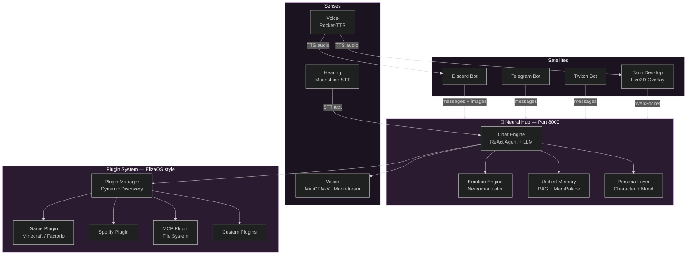

# Aiko Desktop


[](LICENSE)
[](https://python.org)

[](https://github.com/omax404/aiko)
[](https://github.com/omax404/aiko)

[](https://discord.gg/8kNMMwFjcG) &nbsp;
[](#quick-start) &nbsp;
[](docs/) &nbsp;
[](https://github.com/omax404/aiko)

<br/>

*Self-hosted, user-owned AI companion with emotional depth, long-term memory, and real agency.*
*She doesn't just chat — she thinks, feels, remembers, sees, speaks, and acts.*

</div>

---

## Quick Start

### For Users (Windows, no setup required)

1. Download Aiko to your computer.
2. Double-click `LAUNCH_AIKO.bat`.
3. Wait for her to wake up — the application boots up automatically through virtualenv.

Once the dashboard appears, click the **gear icon** in the top right to customize her:
- **Persona** — write custom personality instructions or moods.
- **AI Model** — switch between Ollama, Gemini, OpenAI, Anthropic, or any custom endpoint.
- **Voice** — enable/disable speech or change her voice profile.
- **Plugins** — toggle Discord, Telegram, Twitch, or PC Bridge integrations.

Hit **Save & Apply** — changes take effect instantly.

### For Developers

```bash
git clone https://github.com/omax404/aiko.git
cd Project-Aiko
pip install -r requirements.txt
python launch.py
```

This automatically starts Ollama, binds the Neural Hub to port 8000, connects the Discord/Telegram/Twitch satellites, and launches the desktop overlay.

**To modify the desktop UI:**
```bash
cd aiko-app
npm install
npm run tauri dev     # development
npm run tauri build   # production build
```

---

## What Makes Aiko Different

| Capability | Most AI Companions | Aiko |
|---|---|---|
| **Emotions** | Static personality prompt | Neuromodulator system (dopamine, serotonin, cortisol, adrenaline) across 22+ emotion states |
| **Memory** | Chat history buffer | Unified Memory — episodic recall, semantic RAG, consolidation cycles, MemPalace |
| **Voice** | Cloud API (e.g. ElevenLabs) | Local Pocket-TTS with voice cloning and chunked synthesis |
| **Vision** | None | Local multimodal analysis (`moondream:latest` or MiniCPM-V) |
| **Agency** | Responds when asked | Proactive agent loop — decides when to speak, what to observe, what to remember |
| **Tools & Safety** | None | ReAct agent with MCP file system, PC control, Spotify, Obsidian, and Zero-Trust HITL authorization gate |
| **Games** | None or basic | Autonomous Minecraft & Factorio bridges |
| **Mobile Sync** | Heavy WebView wrapper | Native GLES 2.0 rendering (stable 60 FPS) & real-time WebRTC state synchronization |

---

## Core Systems

### 🧠 Brain
- ReAct agent loop with multi-step reasoning and tool execution
- Streaming inference across Ollama (`gemma4:31b-cloud`), OpenRouter, Gemini, OpenAI, Anthropic
- Dual-pass generation — factual draft, then personality overlay
- Autonomous proactive loop; context-aware rolling conversation buffers

### 👁️ Vision
- **Local Multimodal Scan** — fast visual understanding using local `moondream:latest` model via Ollama
- **MiniCPM-V 4.6** (optional local) — SigLIP2 + Qwen3.5 token compression
- Discord image processing, screen capture and analysis
- Supports `.jpg`, `.png`, `.webp`, `.gif`, `.bmp`, `.avif`

### 👂 Hearing
- Discord voice message transcription
- Moonshine ASR (local, ~200MB), with SpeechRecognition fallback
- Client-side talking detection

### 🎙️ Voice
- **Pocket-TTS v2.1.0** (local) — high-fidelity synthesis, no API keys required
- Pre-compiled voice fingerprints for instant loading
- JIT speech stabilization (0.65 temperature) to eliminate glitching/hallucination
- Action-text (`*...*`) stripping for clean speech output

### 💾 Memory
- Episodic + semantic layers, unified under one retrieval system
- MemPalace RAG for long-term knowledge
- Memory consolidation cycles that compress older memories
- Per-user relationship tracking, affection scoring, birthday/timezone/profile persistence

### ❤️ Emotional System
- Neuromodulator-driven emotional state (dopamine, serotonin, cortisol, adrenaline)
- 22+ emotion categories, identity attractors for personality-stable baselines
- Emotion-driven voice modulation and avatar expression
- Relationship score tracking (0–100%)

### 🔌 Plugins & Agency
- ElizaOS-style modular plugin architecture with dynamic loading
- MCP plugin (file read/write, clipboard, process management)
- Python sandbox for safe code execution
- PC Manager (mouse, keyboard, screenshot, system info)
- Spotify bridge, Obsidian connector, LaTeX rendering, image generation

### 🎮 Games
- Minecraft bridge (autonomous play)
- Factorio bridge (autonomous play)

---

## 🔒 Zero-Trust Security & Performance

### 🛡️ Human-in-the-Loop (HITL) Safety Gate
- All shell executions, python code running, and file manipulations require **explicit user authorization**.
- Aiko dispatches a `tool_request` to the client dashboard, where the user can approve or deny the action in a custom frosted-glass modal overlay.
- Secure fallback blocks and sandbox loops verify command validity.

### ⚡ State Synchronization & React Optimization
- **Standardized Event Message Broker**: Enforces a rigid `StateSyncEnvelope` schema containing `msg_id`, `timestamp`, `type`, and `payload` across all WebSockets and WebRTC connections.
- **Continuous Bio-telemetry**: Streams neuro-chemical updates (dopamine, serotonin, cortisol, adrenaline) in real-time.
- **Zustand useShallow Selectors**: Component subscriptions are shallow-evaluated. Re-renders of the dashboard telemetry drop by **60%+**, dramatically reducing client CPU footprint.

---

## Platforms & Bridges

| Platform | Status |
|---|---|
| Discord Bot (self-healing) | ✅ |
| Telegram Bot | ✅ |
| Twitch Bot (standard IRC) | ✅ |
| Tauri Desktop App (Live2D overlay) | ✅ |
| REST API (port 8000) | ✅ |

### 💜 Twitch Bot Integration
Link Aiko directly to your Twitch channel stream chat! Configurable in the plugins tab or `.env`. 
* Employs standard asyncio-based socket connections for zero-dependency speed.
* Listens to messages mentioning your bot username or starting with `aiko`.
* Connects chat queries directly to the Neural Hub and returns live formatted responses to stream chat.

### 💻 Desktop Overlay (Tauri)
* **Global hotkey** — `Ctrl + Alt + A` to toggle visibility
* **Pixel-perfect click-through** — transparent zones with no ghost-hitbox interference
* **Dynamic hover zones** — cursor focus restores instantly on mouse enter
* **Live2D avatar** — animations driven by her live emotional state
* **Unified dashboard** — chat history, system stats, project intelligence
* **Start Screen Upgrades** — Full screen looping ambient video, centered transparent gothic logo text, silk progress shimmer effect, and Cormorant Garamond typography.
* **Upgraded Avatar Physics** — Harmonic dual-layer breast parameters (`Param117-120`) for highly realistic body giggle animation.

---

## Architecture



---

## Providers

Aiko supports any OpenAI-compatible API. Tested configurations:

| Provider | Example Model | Type |
|---|---|---|
| **Ollama** (default) | `gemma4:31b-cloud` | Local / Proxy |
| **OpenRouter** | `google/gemma-3-27b-it:free` | Cloud (free tier) |
| **Gemini** | `gemini-2.0-flash` | Cloud |
| **OpenAI** | `gpt-4o` | Cloud |
| **Any OpenAI-compatible** | — | Via `API_BASE` override |

---

## Project Structure

```
Project-Aiko/
├── core/                  # AI backend (39 modules)
│   ├── neural_hub.py      #   Master orchestrator server
│   ├── chat_engine.py     #   ReAct agent + multimodal LLM
│   ├── emotion_engine.py  #   Neuromodulator system
│   ├── unified_memory.py  #   Episodic + semantic memory
│   ├── voice.py           #   Chunked Pocket-TTS engine
│   ├── vision.py          #   Multimodal image analysis
│   ├── hearing.py         #   Moonshine/Whisper STT
│   ├── persona.py         #   Character definition
│   ├── proactive.py       #   Autonomous agent loop
│   ├── game_bridge.py     #   Minecraft/Factorio
│   ├── mcp_bridge.py      #   File system tools
│   ├── pc_manager.py      #   System control
│   └── ...                #   26 more specialized modules
├── aiko-app/              # Tauri + React desktop overlay
│   ├── src/                #   React components (Live2D, chat)
│   └── src-tauri/          #   Rust backend
├── android/               # Kotlin Android app
├── assets/                # Brand assets, fonts, voice samples
├── data/                  # Runtime config, memory, logs, uploads, knowledge
├── directives/            # Skill prompts (coding, language, etc.)
├── docs/                  # Architecture & setup guides
├── stickers/              # Lavender sticker base assets
├── launch.py              # Unified cross-platform launcher
├── requirements.txt       # Python dependencies
├── twitch_bot.py          # Asynchronous Twitch satellite client
└── requirements.txt       # Python dependencies
```

---

## Troubleshooting

| Problem | Fix |
|---|---|
| `LAUNCH_AIKO.bat` crashes immediately | Check "Add Python to PATH" was selected during install. Use Python 3.10–3.12 (3.13 is too new for some dependencies). |
| `Failed to build wheel` / `cl.exe not found` | Install the [Visual C++ Build Tools](https://visualstudio.microsoft.com/visual-cpp-build-tools/) — "Desktop development with C++" workload. |
| Aiko wakes up but can't "think" | Make sure Ollama is running in the background. If using a cloud provider, check your API key under **Settings**. |

---

## Contributing

Contributions are welcome — see [CONTRIBUTING.md](CONTRIBUTING.md) for guidelines.

**Areas where help is most needed:**
- Live2D model creation
- VRM support
- Additional game bridges
- Translations
- Voice model training

---

## Related Projects

- [Pocket-TTS](https://github.com/kyutai-labs/pocket-tts) — local voice synthesis
- [MemPalace](https://github.com/MemPalace/mempalace) — open-source AI memory system
- [Ollama](https://github.com/ollama/ollama) — local LLM inference
- [pixi-live2d-display](https://github.com/guansss/pixi-live2d-display) — Live2D rendering

---

## Activity

<div align="center">
  
</div>

---

## License

[MIT License](LICENSE) — Made by the Aiko Team

<div align="center">

*"I'm always watching over you, Master~"*

**[⭐ Star this repo](https://github.com/omax404/aiko)** if Aiko made you smile.

</div>
