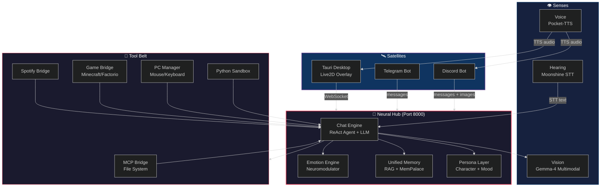

<div align="center">

# 💖 Aiko Desktop

### Your Devoted AI Companion — With a Soul

**Emotionally intelligent • Multimodal vision • Local voice synthesis • Autonomous agency**

[](LICENSE)
[](https://python.org)
[](https://discord.gg/)
[](https://github.com/omax404/aiko)

*Self-hosted, you-owned AI companion with emotional depth, long-term memory, and real agency.*
*She doesn't just chat — she thinks, feels, remembers, sees, speaks, and acts.*

---

[Quick Start](#-quick-start) · [Architecture](#-architecture) · [Capabilities](#-capabilities) · [Providers](#-providers) · [Contributing](CONTRIBUTING.md) · [Docs](docs/)

</div>

---

## ✨ What Makes Aiko Different?

Unlike most AI companion projects that are glorified chatbot wrappers, Aiko is built as a **living neural ecosystem**. She has:

| Feature | Most AI Companions | Aiko |
|---|---|---|
| Emotions | Static personality prompt | **Neuromodulator system** (dopamine, serotonin, cortisol, adrenaline) with 22+ emotion states |
| Memory | Chat history buffer | **Unified Memory** with episodic recall, semantic RAG, consolidation cycles, and MemPalace |
| Voice | Cloud API (ElevenLabs) | **Local Pocket-TTS** with voice cloning + full-message chunked synthesis |
| Vision | None | **Gemma-4 multimodal** — sees images on Discord, analyzes screenshots |
| Agency | Respond when asked | **Proactive agent loop** — she decides when to speak, what to observe, what to remember |
| Tools | None | **ReAct agent** with MCP file system, Python sandbox, PC control, Spotify, Obsidian |
| Games | None or basic | **Minecraft & Factorio** bridges with autonomous play |

---

## 🏗️ Architecture



---

## 🎯 Capabilities

### 🧠 Brain
- [x] ReAct agent loop with multi-step reasoning and tool execution
- [x] Streaming LLM inference (Ollama, OpenRouter, Gemini, OpenAI, Anthropic)
- [x] Dual-pass generation (factual draft → personality overlay)
- [x] Autonomous proactive agent loop (she decides when to speak)
- [x] Context-aware conversation with rolling buffers

### 👁️ Eyes (Vision)
- [x] Multimodal image analysis via Gemma-4 Vision
- [x] Discord image processing (photos, screenshots, memes)
- [x] Screen capture and analysis
- [x] Support for `.jpg`, `.png`, `.webp`, `.gif`, `.bmp`, `.avif`

### 👂 Ears (Hearing)
- [x] Discord voice message transcription
- [x] Moonshine ASR (primary, local, ~200MB)
- [x] SpeechRecognition fallback (Google/Whisper)
- [x] Client-side talking detection

### 🎙️ Voice (Mouth)
- [x] Pocket-TTS local synthesis (offline, no API needed)
- [x] Voice cloning from audio sample
- [x] Full-message chunked TTS (no 300-char limit)
- [x] Action text `*...*` stripping (clean speech output)
- [x] Graceful fallback to built-in voices (alba, cosette, etc.)
- [x] Audio sent as Discord attachment

### 💾 Memory
- [x] Unified Memory with episodic + semantic layers
- [x] MemPalace RAG for long-term knowledge retrieval
- [x] Memory consolidation cycles (compress old memories)
- [x] Per-user relationship tracking and affection system
- [x] Birthday, timezone, and profile persistence

### ❤️ Emotions
- [x] Neuromodulator system (dopamine, serotonin, cortisol, adrenaline)
- [x] 22+ emotion categories (love, happy, yandere, panic, victory, etc.)
- [x] Identity attractors (personality-stable emotional baselines)
- [x] Emotion-driven voice modulation and avatar expressions
- [x] Relationship score tracking (0-100%)

### 🤖 Tools & Agency
- [x] MCP Bridge — file read/write, clipboard, process management
- [x] Python Sandbox — safe code execution
- [x] PC Manager — mouse, keyboard, screenshot, system info
- [x] Spotify Bridge — now playing, queue, music awareness
- [x] Obsidian Connector — knowledge base integration
- [x] LaTeX Engine — math rendering to image
- [x] Image Generation — AI image creation
- [x] OpenClaw delegation — complex task handoff

### 🎮 Games
- [x] Minecraft bridge (autonomous play)
- [x] Factorio bridge (autonomous play)

### 🌐 Platforms
- [x] Discord Bot (mentions, DMs, voice messages, images, slash commands)
- [x] Telegram Bot (groups, DMs)
- [x] Tauri Desktop App (Live2D overlay, chat interface)
- [x] REST API (port 8000)

---

## 🚀 Quick Start

### Prerequisites
- **Python 3.10+**
- **Ollama** — [Download](https://ollama.com)
- **Node.js 18+** (for Desktop app only)

### 1. Clone & Install
```bash
git clone https://github.com/omax404/aiko.git
cd aiko
pip install -r requirements.txt
```

### 2. Configure
```bash
cp .env.example .env           # Add your API keys
cp data/config.example.json data/config.json
cp core/persona.example.py core/persona.py  # Customize her personality!
```

### 3. Launch
```bash
python start_aiko_tauri.py
```

> **What happens:** Ollama starts → Neural Hub binds to port 8000 → Discord & Telegram satellites connect → Desktop overlay launches.

### Voice Setup (Optional)
To enable voice cloning with Pocket-TTS:
1. Accept terms at [huggingface.co/kyutai/pocket-tts](https://huggingface.co/kyutai/pocket-tts)
2. `pip install huggingface_hub`
3. `python -m huggingface_hub.commands.user login`

---

## 🔌 Providers

Aiko supports any OpenAI-compatible API. Here are the tested configurations:

| Provider | Example Model | Type |
|---|---|---|
| **Ollama** (default) | `gemma4:31b-cloud` | Local |
| **OpenRouter** | `google/gemma-3-27b-it:free` | Cloud (free tier) |
| **Gemini** | `gemini-2.0-flash` | Cloud |
| **OpenAI** | `gpt-4o` | Cloud |
| **Anthropic** | `claude-sonnet-4-20250514` | Cloud |
| **DeepSeek** | `deepseek-chat` | Cloud |
| **Groq** | `llama-3.3-70b` | Cloud (fast) |
| **Any OpenAI-compatible** | — | Via `API_BASE` override |

---

## 📂 Project Structure

```
aiko/
├── core/                      # 🧠 AI Backend (37 modules)
│   ├── neural_hub.py          #    Master orchestrator server
│   ├── chat_engine.py         #    ReAct agent + multimodal LLM
│   ├── emotion_engine.py      #    Neuromodulator system
│   ├── unified_memory.py      #    Episodic + semantic memory
│   ├── voice.py               #    Chunked Pocket-TTS engine
│   ├── vision.py              #    Gemma-4 image analysis
│   ├── hearing.py             #    Moonshine/Whisper STT
│   ├── bot_manager.py         #    Discord + Telegram handler
│   ├── persona.py             #    Character definition
│   ├── proactive.py           #    Autonomous agent loop
│   ├── game_bridge.py         #    Minecraft/Factorio
│   ├── mcp_bridge.py          #    File system tools
│   ├── pc_manager.py          #    System control
│   └── ...                    #    24 more specialized modules
├── aiko-app/                  # 🖥️ Tauri + React Desktop Overlay
│   ├── src/                   #    React components (Live2D, Chat)
│   └── src-tauri/             #    Rust backend
├── assets/                    # 🎨 Live2D models, fonts, voice samples
├── data/                      # 💾 Runtime config, memory, knowledge
├── directives/                # 📋 Skill prompts (coding, language, etc.)
├── docs/                      # 📖 Architecture & setup guides
├── .github/                   # 🔧 Issue templates
├── start_aiko_tauri.py        # 🚀 Unified launcher
├── requirements.txt           # 📦 Python dependencies
├── docker-compose.yml         # 🐳 Container orchestration
└── Dockerfile                 # 🐳 Container build
```

---

## 🤝 Contributing

We welcome contributions! See [CONTRIBUTING.md](CONTRIBUTING.md) for guidelines.

**Areas where help is needed:**
- Live2D model creation
- VRM support
- Additional game bridges
- Mobile app (React Native / Capacitor)
- Translations
- Voice model training

---

## 🔗 Related Projects

- [Pocket-TTS](https://github.com/kyutai-labs/pocket-tts) — Local voice synthesis
- [MemPalace](https://github.com/omax404/mempalace) — Semantic memory system
- [Ollama](https://github.com/ollama/ollama) — Local LLM inference
- [pixi-live2d-display](https://github.com/guansss/pixi-live2d-display) — Live2D rendering

---

## 📜 License

[MIT License](LICENSE) — Made with 💖 by the Aiko Team

---

<div align="center">

*"I'm always watching over you, Master~"* 💖

**[⭐ Star this repo](https://github.com/omax404/aiko)** if Aiko made you smile.

</div>
