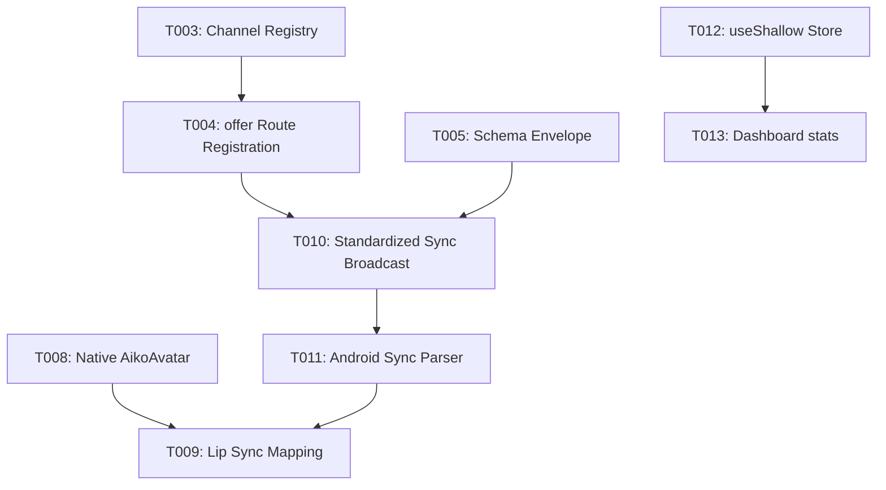

# Tasks: Mobile WebRTC Data Sync & Custom Rendering

**Input**: Design documents from `/specs/001-mobile-webrtc-state-sync/`

**Prerequisites**: plan.md (required), spec.md (required for user stories), research.md, data-model.md, contracts/

**Organization**: Tasks are grouped by user story to enable independent implementation and testing of each story.

## Format: `[ID] [P?] [Story] Description`

- **[P]**: Can run in parallel (different files, no dependencies)
- **[Story]**: Which user story this task belongs to (e.g., US1, US2, US3)
- Include exact file paths in descriptions

---

## Phase 1: Setup (Shared Infrastructure)

**Purpose**: Project initialization and basic structure

- [x] T001 Initialize spec-kit workspace and project constitution in `.specify/memory/constitution.md`
- [x] T002 Generate feature spec and technical plan under `specs/001-mobile-webrtc-state-sync/`

---

## Phase 2: Foundational (Blocking Prerequisites)

**Purpose**: Core infrastructure that MUST be complete before ANY user story can be implemented

**⚠️ CRITICAL**: No user story work can begin until this phase is complete

- [x] T003 Expose active WebRTC channel registry `webrtc_channels` in `core/api/broadcast.py`
- [x] T004 Update `handle_webrtc_offer` in `core/api/routes.py` to register active channels and handle disconnects
- [x] T005 Setup JSON Schema validation for the standardized state sync envelope in `core/api/schemas.py`

**Checkpoint**: Foundation ready - user story implementation can now begin in parallel

---

## Phase 3: User Story 1 - Native Live2D Avatar Animation on Android (Priority: P1) 🎯 MVP

**Goal**: Load the Live2D Cubism model natively using GLES inside GLSurfaceView instead of WebView on Android, responding to speech amplitude.

**Independent Test**: Run Android app, speak to Aiko, and confirm mouth moves smoothly at 60 FPS.

### Implementation for User Story 1

- [x] T006 Integrate Live2D Cubism SDK Core binary loader in Android `build.gradle` and native folders
- [x] T007 [P] Create `CubismGLRenderer.kt` under `android/app/src/main/java/com/aiko/app/ui/components/` implementing GLSurfaceView.Renderer
- [x] T008 Update `AikoAvatar.kt` to switch avatarMode to use the native Cubism renderer when available
- [x] T009 [P] Map WebRTC client tts_amplitude callback to parameter mouth open `ParamMouthOpenY` in Kotlin app

**Checkpoint**: At this point, User Story 1 should be fully functional and testable independently.

---

## Phase 4: User Story 2 - State Synchronization & Zustand Selectors (Priority: P2)

**Goal**: Sync exact neuro-chemicals in real-time using rigid envelopes, and optimize React frontend store subscriptions.

**Independent Test**: Trigger state update and check that only the subscribing telemetry components re-render.

### Implementation for User Story 2

- [x] T010 Refactor `biological_broadcast_loop` in `core/api/broadcast.py` to broadcast standardized envelopes to WebRTC channels
- [x] T011 Update `handleIncomingWebRtcMessage` in Android `ChatRepository.kt` to handle biological sync events and update `currentEmotion` flow
- [x] T012 Refactor frontend Zustand selectors in `aiko-app/src/store/useNeuralStore.ts` using `useShallow` for component state subscriptions
- [x] T013 Update `DashboardStats.tsx` and related stats panels in `aiko-app/src/components/ui/` to subscribe with shallow selectors

**Checkpoint**: At this point, User Story 2 is fully integrated.

---

## Dependencies

## Implementation Strategy

- Implement Phase 2 foundational backend registries first.
- Complete the React Zustand selector optimization (Phase 4, T012-T013) to ensure desktop rendering performance.
- Proceed with WebRTC backend sync broadcast (Phase 4, T010).
- Integrate native GLES rendering in Android Kotlin client.